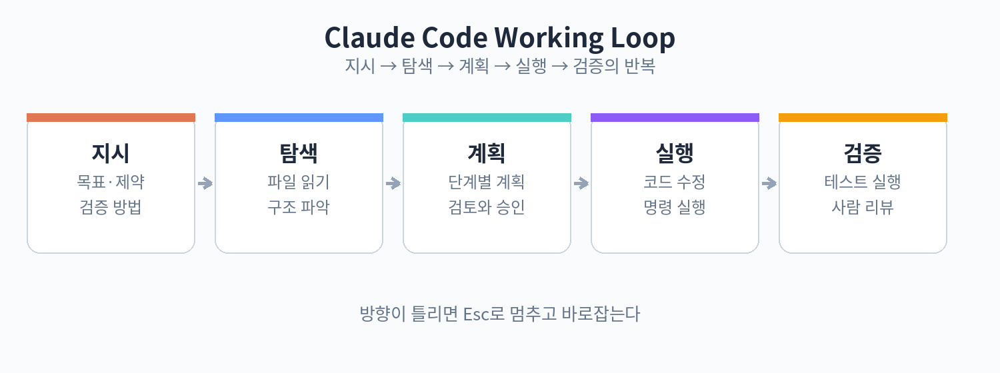

# 11. 첫 세션

프로젝트 폴더에서 claude를 실행하면 세션이 시작됩니다. 프롬프트에 지시를 입력하면 Claude Code가 작업을 시작합니다. 처음에는 작은 작업부터 맡겨 보세요. "이 프로젝트의 구조를 설명해줘" 같은 탐색 작업이 좋습니다. Claude Code가 파일들을 읽고 전체 구조를 파악해 설명합니다.

지시를 잘 주는 요령이 있습니다. 첫째, 목표를 분명히 말합니다. "버그를 고쳐줘"보다는 "로그인 버튼을 눌렀을 때 간헐적으로 실패하는 문제를 찾아 고쳐줘"가 낫습니다. 둘째, 제약을 함께 줍니다. "테스트를 깨뜨리지 말고", "이 파일은 건드리지 말고" 같은 식입니다. 셋째, 검증 방법을 정합니다. "고친 뒤 관련 테스트를 돌려줘"라고 하면 스스로 검증합니다.

작업 중에는 중간 과정을 볼 수 있습니다. 어떤 파일을 읽고 있는지, 어떤 명령을 실행하는지가 표시됩니다. 마음에 안 드는 방향으로 가면 Esc로 멈추고 방향을 바로잡습니다. 세션이 끝나면 /compact로 대화를 요약하거나, 새 세션을 시작합니다.

실습: 프로젝트 탐색
1. 자신의 프로젝트 폴더에서 claude 실행
2. "이 프로젝트의 구조와 주요 모듈을 설명해줘" 입력
3. 설명을 읽고 빠진 부분이 있으면 추가 질문

핵심 정리
- 작은 탐색 작업부터 맡기며 감을 익힌다.
- 목표, 제약, 검증 방법을 함께 지시한다.
- 방향이 틀리면 Esc로 멈추고 바로잡는다.
