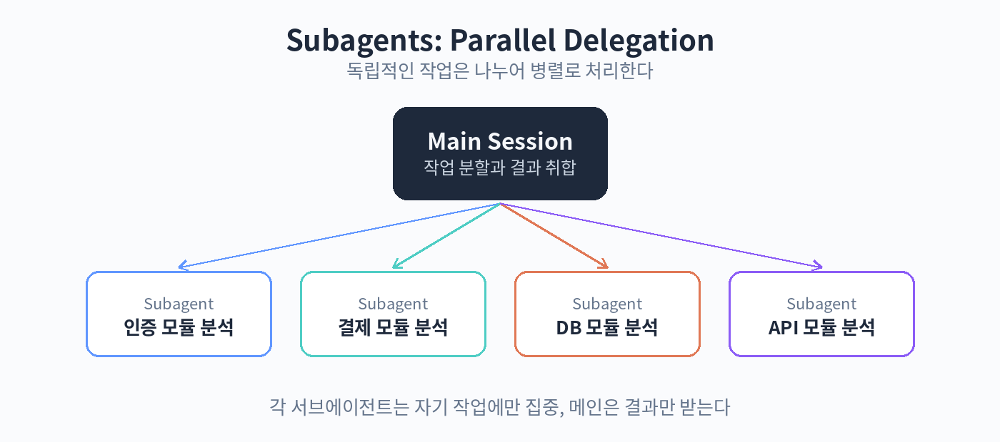

# 22. 서브에이전트

서브에이전트는 메인 세션이 일을 맡기는 하위 에이전트입니다. 큰 작업을 나누어 병렬로 처리할 때 씁니다. 예를 들어 "이 코드베이스의 인증 모듈과 결제 모듈을 각각 분석해줘"라고 하면, 두 서브에이전트가 동시에 각 모듈을 분석하고 결과를 모아 줍니다.

서브에이전트를 쓰는 이유는 두 가지입니다. 첫째, 속도입니다. 독립적인 작업은 병렬로 돌리면 빨라집니다. 둘째, 컨텍스트 분리입니다. 각 서브에이전트는 자기 작업에만 집중해서, 메인이 불필요한 세부 내용으로 가득 차는 것을 막습니다. 탐색처럼 범위가 넓은 작업에 특히 효과적입니다.

커스텀 서브에이전트도 만들 수 있습니다. .claude/agents 폴더에 정의 파일을 놓습니다. 역할, 쓸 수 있는 도구, 지침을 정합니다. 예를 들어 "코드 리뷰어" 에이전트는 읽기 도구만 쓰고, "테스트 작성자" 에이전트는 쓰기와 실행 도구를 쓰는 식입니다. 자주 쓰는 역할은 미리 정의해 두면 매번 설명하지 않아도 됩니다.

주의할 점도 있습니다. 서브에이전트는 메인의 맥락을 다 알지 못합니다. 넘길 때는 필요한 정보를 함께 줘야 합니다. "auth/ 폴더를 분석해줘"가 아니라 "auth/ 폴더의 로그인 흐름을 분석하고, 세션 처리 방식과 에러 케이스를 정리해줘"처럼 구체적으로 지시합니다. 결과는 메인이 검증합니다.

실습: 병렬 분석
1. 두 개의 독립 모듈을 정하기
2. 서브에이전트에 각각 분석을 맡기기
3. 결과를 모아 비교하기

핵심 정리
- 서브에이전트는 작업을 나누어 병렬 처리하는 하위 에이전트다.
- 속도와 컨텍스트 분리가 장점이다.
- 넘길 때는 필요한 정보를 구체적으로 함께 준다.
