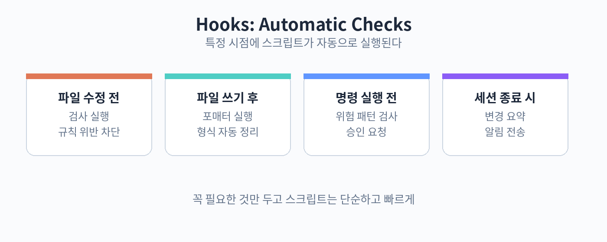

# 31. hooks

hooks는 특정 시점에 자동으로 실행되는 스크립트입니다. "파일을 고치기 전에 이 검사를 돌려", "작업이 끝나면 이렇게 알려줘" 같은 자동화를 걸 수 있습니다.

대표적인 사용처입니다. 파일 수정 전에 린트를 돌려 규칙 위반을 미리 잡습니다. 명령 실행 전에 위험한 패턴이 있는지 검사합니다. 세션이 끝나면 변경 사항을 요약해 알립니다. 매번 사람이 신경 쓰지 않아도 되게 만드는 장치입니다.

hooks는 설정 파일에 이벤트별로 등록합니다. 이벤트는 작업 전, 작업 후, 세션 종료 같은 시점입니다. 각 이벤트에 실행할 명령을 적습니다. 예를 들어 "파일 쓰기 후" 이벤트에 포매터를 연결하면, Claude Code가 파일을 고칠 때마다 자동으로 형식이 맞춰집니다.

hooks를 쓸 때 주의할 점입니다. 너무 많이 걸면 세션이 느려집니다. 꼭 필요한 것만 둡니다. hooks 자체가 실패하면 작업이 멈출 수 있으니, hooks 스크립트는 단순하고 빠르게 만듭니다. 팀으로 공유할 때는 hooks 설정도 저장소에 넣어 함께 관리합니다.

실습: 포맷 hooks
1. 파일 쓰기 후 포매터를 돌리는 hooks 등록하기
2. Claude Code에게 파일 수정을 맡겨보기
3. 자동으로 포맷이 적용되는지 확인하기

핵심 정리
- hooks는 특정 시점에 자동 실행되는 스크립트다.
- 검사와 포맷 같은 반복 확인을 자동화한다.
- 꼭 필요한 것만 두고 스크립트는 단순하게 만든다.
