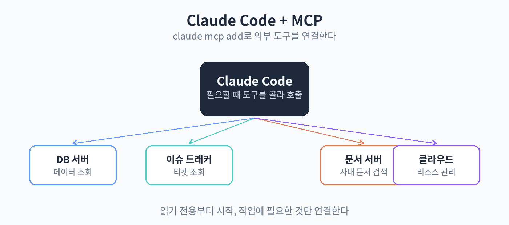

# 32. MCP 연동

MCP는 AI가 외부 도구를 쓰는 공개 표준입니다. Claude Code에 MCP 서버를 연결하면, Claude Code가 그 서버의 도구를 쓸 수 있습니다. 예를 들어 데이터베이스 MCP 서버를 연결하면 "지난주 가입자 수를 알려줘"라고 했을 때 직접 DB를 조회합니다.

연결은 claude mcp add 명령으로 합니다. 서버 주소와 전송 방식을 지정합니다. 로컬에서 도는 서버는 stdio로, 원격 서버는 HTTP로 연결합니다. 원격 서버는 OAuth 인증을 쓰는 것이 권장됩니다. 연결된 서버는 /mcp 같은 명령으로 확인할 수 있습니다.

어떤 MCP 서버를 연결할지는 작업에 따라 정합니다. 이슈 트래커, 데이터베이스, 문서, 클라우드 서비스 같은 것들이 대표적입니다. 너무 많이 연결하면 Claude Code가 도구를 고르는 데 헷갈리니, 현재 작업에 필요한 것만 연결합니다. 프로젝트별로 설정 파일을 두어 관리합니다.

MCP 도구를 쓸 때의 원칙입니다. 읽기 전용 도구부터 시작합니다. 쓰기 도구는 꼭 필요할 때만 연결하고, 중요한 작업은 승인 과정을 둡니다. 외부 MCP 서버는 신뢰할 수 있는 것만 씁니다. 모르는 서버를 연결하면 데이터가 새나갈 수 있습니다.

실습: MCP 서버 연결
1. 공개된 MCP 서버 하나를 정하기 (예: 파일시스템)
2. claude mcp add로 연결하기
3. "이 폴더의 파일 목록을 보여줘"로 동작 확인하기

핵심 정리
- MCP 서버를 연결하면 Claude Code가 외부 도구를 쓸 수 있다.
- 작업에 필요한 것만 연결하고 읽기 전용부터 시작한다.
- 신뢰할 수 있는 서버만 쓰고 쓰기 도구는 신중하게 다룬다.
