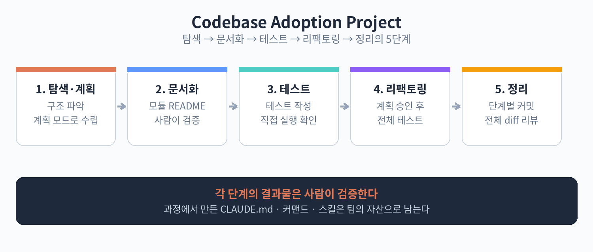

# Part 6. 실전 프로젝트

## 60. 코드베이스 문서화·테스트·리팩토링 자동화

이 장에서는 기존 코드베이스에 Claude Code를 도입하는 과정을 처음부터 끝까지 따라 합니다. 대상은 문서가 부족하고 테스트가 듬성듬성한 평범한 프로젝트입니다. 목표는 세 가지입니다. 핵심 모듈의 문서를 만들고, 테스트 커버리지를 올리고, 안전한 리팩토링을 수행합니다.

1단계: 탐색과 계획입니다. 새 세션을 열고 "이 프로젝트의 구조를 파악하고, 문서화·테스트·리팩토링 계획을 세워줘"라고 합니다. 계획 모드로 진행합니다. Claude Code가 모듈 목록과 우선순위를 제시하면 검토합니다. "결제 모듈부터 시작해줘"처럼 순서를 정합니다.

2단계: 문서화입니다. 모듈별로 "이 모듈의 README를 작성해줘"라고 맡깁니다. 지침을 구체적으로 줍니다. "공개 함수 목록, 사용 예제, 주의사항을 포함해줘" 같은 식입니다. 만들어진 문서는 사람이 읽어보고 틀린 부분을 고칩니다. AI가 지어낸 내용이 없는지 확인하는 것이 핵심입니다.

3단계: 테스트 보강입니다. "이 모듈의 테스트를 작성해줘. 기존 테스트 스타일을 따라줘"라고 합니다. 기존 테스트가 있다면 그 패턴을 따르게 하고, 없다면 작은 것부터 만듭니다. 작성된 테스트를 직접 돌려서 통과하는지 봅니다. 통과하지 못하는 테스트는 Claude Code에게 다시 맡깁니다.

4단계: 리팩토링입니다. 계획 모드로 "이 함수의 중복을 제거하는 계획을 세워줘"부터 시작합니다. 계획을 검토하고 승인한 뒤 실행합니다. 리팩토링 후에는 전체 테스트를 돌립니다. 테스트가 깨지면 멈추고 원인을 봅니다.

5단계: 정리입니다. 변경 사항을 커밋 단위로 나눕니다. "문서화, 테스트, 리팩토링을 각각 커밋해줘"라고 하면 됩니다. 커밋 메시지도 함께 작성하게 합니다. 마지막으로 전체 diff를 사람이 리뷰합니다.

이 과정을 거치면 프로젝트는 문서가 생기고, 테스트가 늘고, 코드가 정리됩니다. 더 중요한 것은 팀에 남는 것입니다. 이때 만든 CLAUDE.md, 커맨드, 스킬은 다음 작업에도 계속 쓰입니다. 한 번의 도입이 지속적인 생산성으로 이어지는 구조입니다.

핵심 정리
- 순서는 탐색·계획, 문서화, 테스트, 리팩토링, 정리다.
- 각 단계의 결과물은 사람이 검증한다.
- 과정에서 만든 설정 자산이 팀에 남는다.
